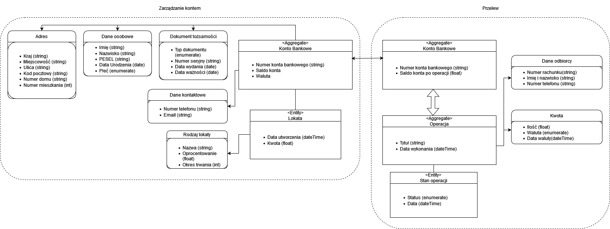

# Domain Driven Design

## Opis zadania

Zamodelowanie aplikacji bankowej z wykorzystaniem Domain Driven Design. Zadbać o wydzielenie kontekstów, zdefiniowanie agregatów i encji, ustalenie typów wartości i ograniczeń.

W swojej realizacji zadania skupiłem się na kontekście zarządzania kontem bankowym oraz kontekście dokonywania przelewów.

### Wstępne założenia:

 - na osobę przypada wyłącznie jedno konto bankowe,
 - użytkownik na przestrzeni lat może założyć kilka lokat oszczędnościowych,
 - konto zawiera większość potrzebnych prawnie informacji o kliencie (dane kontaktowe, osobowe, dokument tożsamości, adres),
 - przelew może być wykonywany na konto poprzez numer rachunku bankowego albo numer telefonu
 - jest brana pod uwaga waluta wykorzystywana na koncie i w przelewie

## Model

  
  ## Ograniczenia

Rodzaje typów:
 - string - wartośc tekstowa
 - float - wartośc zmienno-przecinkowa
 - int - wartość całkowitoliczbowa
 - enumerate - wartość z grona kilku wybranych możliwości
 - date - dzień, miesiąc, rok
 - dateTime - date, który zawiera dodatkowo godzinę, minute i sekunde

### Zarzadzanie kontem

 - Konto Bankowe (Aggregate)
    - Numer konta bankowego (string 26 cyfr)
    - Saldo konta (float)
    - Waluta (enumerate)
    - Dane osobowe (Value Object)
    - Adres (Value Object)
    - Dokument tożsamości (Value Object)
    - Dane kontaktowe (Value Object)

 - Adres
    - Kraj (string: 32 litery)
    - Miejscowość (string: 32 litery)
    - Ulica (string: 32 litery)
    - Kod pocztowy (string [0-9]{9})
    - Numer domu (string: 1-4 cyfry + potencjalnie zakończone literą )
    - Numer mieszkania (int)

 - Dane osobowe
    - Imię (string: 32 litery)
    - Nazwisko (string: 32 litery)
    - PESEL (string: 11 cyfr)
    - Data Urodzenia (date)
    - Płeć (enumerate: 'Męska', 'Żeńska')

 - Dokument tożsamości
    - Typ dokumentu (enumerate)
    - Numer i seria (string 3 litery oraz 6 cyfr)
    - Data wydania (date)
    - Data ważności (date)

 - Dane kontaktowe
    - Numer telefonu (string: 9 cyfr)
    - Email (string: 64 litery, cyfry, oraz znaki {@ ,.})

 - Lokata (Entity)
    - Data utworzenia (dateTime)
    - Kwota(float)
    - Rodzaj lokaty (Value Object)

 - Rodzaj lokaty (Value Object)
    - Nazwa (string: 64 litery, cyfry, spacje)
    - Oprocentowanie (float)
    - Okres trwania (int) - podawany w miesiącach

### Przelew

 - Konto Bankowe (Aggregate)
    - Numer konta bankowego (string: 26 cyfr)
    - Saldo konta po operacji (float)

 - Operacja (Aggregate)
    - Tytuł (string: 64 litery, cyfry, spacje oraz znaków {! ,. ,\? , ;})
    - Data wykonania (dateTime)
    - Dane odbiorcy (Value object)
    - Kwota (Value Object)
 
 - Dane odbiorcy (Value Object)
    - Numer rachunku (string: 26 cyfr)
    - Imię i nazwisko (string: 64 liter, spacji)
    - Numer telefonu (string: regex 9 cyfr)

 - Kwota (Value Object)
    - Ilość (float)
    - Waluta (enumerate: 'ZL', 'USD', 'EURO', itd.)
    - Data waluty (dateTime)

 - Stan Operacji (Entity)
    - Status (enumerate: 'w trakcie', 'odrzucona', 'zakończona', 'anulowana')
    - Data (dateTime)

